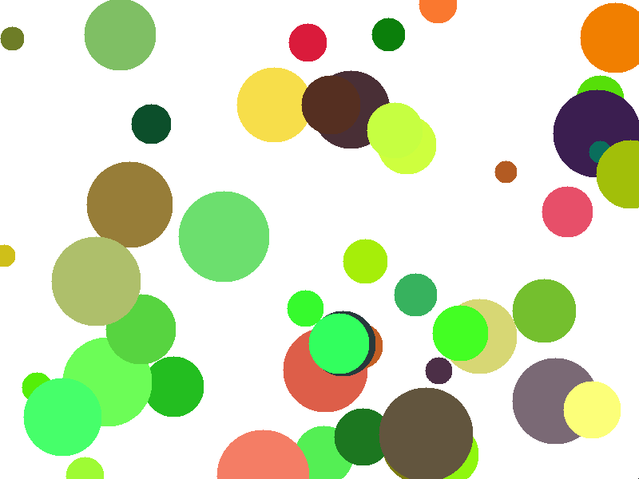
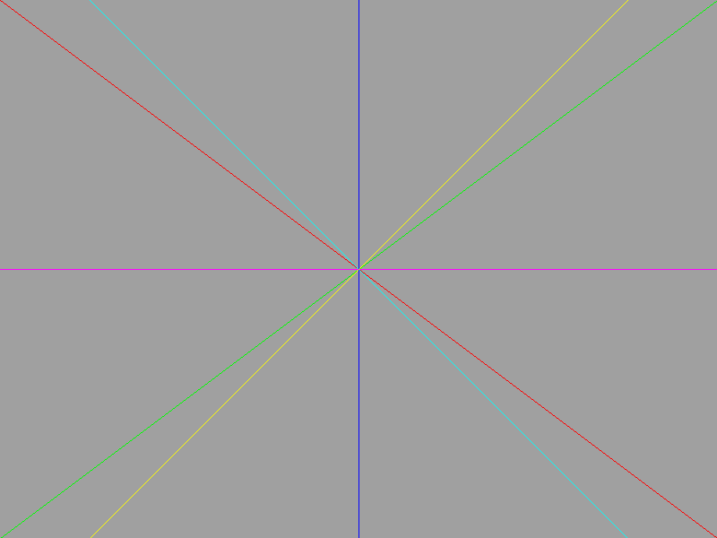
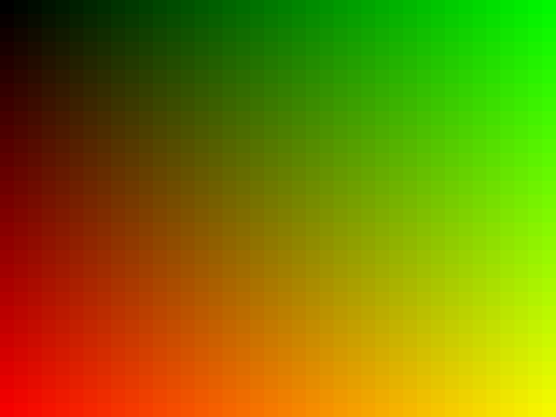

# 2D graphics library in Bash

Simple graphics library that renders into internal memory buffer

The name is a Russian word for "pencil" (["карандаш"](https://translate.google.com/?sl=ru&tl=en&text=%D0%BA%D0%B0%D1%80%D0%B0%D0%BD%D0%B4%D0%B0%D1%88&op=translate)) \
*yes, like olive.c*

## Usage

To use library you need just to include it into your script

```bash
#!/bin/bash

. "$PWD/karanda.sh"

# now you can use library! yay!
```

Before call any draw function you need to initialize internal canvas by `create_canvas` function

```bash
#!/bin/bash

. "$PWD/karanda.sh"

# create_canvas (width) (height) (color)
create_canvas  800 600 0xFFFFFFFF

# now you can draw! yay!
```

To save your masterpiece you can use `save_to_ppm` function

```bash
#!/bin/bash

. "$PWD/karanda.sh"

create_canvas 800 600 0xFFDE22E3

# super secret drawing algorithm

save_to_ppm "my_cool_picture.ppm"
```

## Demos

To run demos, just run `demos.sh`

## Gallery






